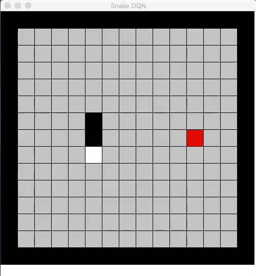

# RL-Snake

A Python environment of the game of Snake to train Reinforcement Learning agents
. This implementation comes with a DQN agent.
Interested in Knowing How it works? Check out [here](https://mkhoshpa.github.io/RLSnake/).

## Installation
     pip install -i https://test.pypi.org/simple/ RL-Snake-mkhoshpa
## Usage:
    import RL_Snake
#### Train:
    board_size = (15,15)
    dqn_agent = RL_Snake.DQNAgent(board_size, path = None)

#### Load a pre-trained agent:
    dqn_agent = RL_Snake.DQNAgent(board_size, path = PATH)

#### View GUI of the game
    RL_Snake.run_gui_game(board_size,dqn_agent)
